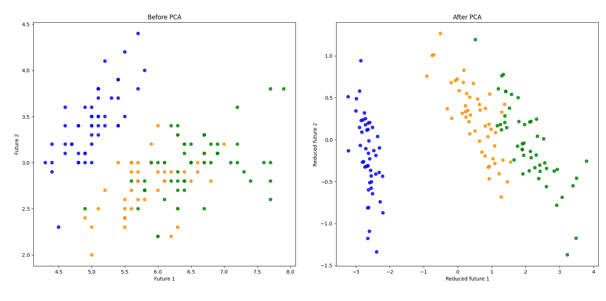

# PCA Implementation

## Information

[Open in PDF](./presentation/PCA_Presentation.pdf)

## Feed
### 1.1.3 (24.05.2025)
- Documentation supplemented

### 1.1.2 (24.05.2025)
- Completed full PCA class with forward and inverse transformation.
- Integrated PCA into [main.py](./scripts/main.py) and visualized the difference plot.
- Visualized MSE and data usage.
- Added strict type annotations.
- Minor bug fixes.

### 1.0.0 (23.05.2025)
*Skipped version information*

### 0.1.0 (23.05.2025)
*First stable version*